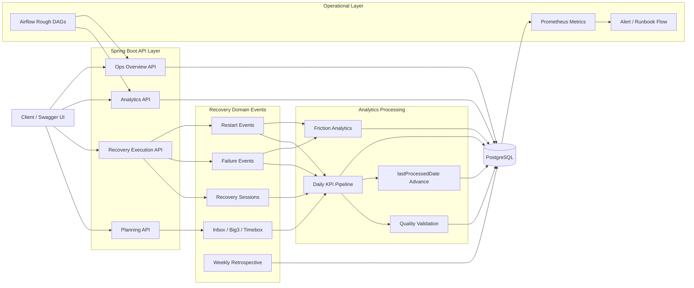

# FocusLoop

Daily Big3 실행 과정의 계획, 실행, 실패, 복귀, 완료 데이터를 수집하고 분석하는 Spring Boot 프로젝트입니다.

현재 코드는 legacy 명칭인 `Big3Selection`, `Big3SelectionItem`을 사용하고 있습니다. 목표 모델에서는 이를 각각 `DailyBig3Board`, `Big3Item`으로 바꾸고 날짜별 선택 관계인 `DailyBig3Entry`를 분리합니다. 같은 주의 `Big3Item`은 실제 작업 identity를 유지하며 category별 주간 분석의 기준이 됩니다.

설계 기준:

```text
DailyBig3Board
-> DailyBig3Entry
   -> Big3Item
      -> ExecutionUnit
         -> Timebox
            -> RecoverySession
```

별도 `Big3Task` 엔티티는 추가하지 않습니다. 상세 기준은 `docs/README.md`와 `docs/spec/`을 따릅니다.

## Portfolio Positioning

- 복귀 세션 시작, 완료, 중단과 실패 체크인, 재시작 이벤트를 별도 도메인 모델로 추적합니다.
- Inbox, Daily Big3, ExecutionUnit, Timebox를 서로 다른 grain으로 관리합니다.
- 기존 일간 KPI mart, quality report, backfill 자산을 보유하고 있습니다.
- 목표 모델에서는 FailureEvent별 복귀 latency, 미복귀, 우측 절단을 category별 주간 fact/mart로 변환합니다.
- PostgreSQL `ON CONFLICT` upsert와 `lastProcessedDate` 추적으로 재실행 안전성을 확보합니다.
- 운영 개요, 알림, 런북, Prometheus 지표까지 포함해 관측 가능한 시스템을 지향합니다.

## System Architecture



## Backend Highlights

- Package-by-domain 구조로 `planning`, `execution`, `analytics`, `friction`, `retrospective`, `common` 책임을 분리했습니다.
- Recovery session, failure event, restart event를 분리 저장해 복귀 lifecycle을 쿼리 가능한 데이터 모델로 구성했습니다.
- 일간 KPI 파이프라인은 raw event를 읽어 mart 저장, quality report 생성, `lastProcessedDate` 갱신까지 한 흐름으로 묶었습니다.
- PostgreSQL에서는 자연키(`user_id`, `metric_date`) 기준 `ON CONFLICT` upsert를 사용해 idempotent 저장을 처리합니다.
- H2 기반 기본 테스트와 PostgreSQL 기반 analytics integration test를 분리해 속도와 런타임 검증을 같이 확보했습니다.
- `Actuator`, `Prometheus`, `/api/v1/ops/**` API, Docker image artifact 생성까지 포함해 운영성과 배포 자동화를 같이 다뤘습니다.

## Representative APIs

- Planning
  - `POST /api/v1/recovery/inbox-items`
  - `POST /api/v1/recovery/big3`
  - `POST /api/v1/recovery/timeboxes`
- Execution
  - `POST /api/v1/recovery/sessions/start`
  - `POST /api/v1/recovery/sessions/complete`
  - `POST /api/v1/recovery/sessions/interrupt`
  - `POST /api/v1/recovery/failures/check-in`
  - `POST /api/v1/recovery/restarts`
- Analytics
  - `POST /api/v1/recovery/analytics/kpis/daily`
  - `GET /api/v1/recovery/analytics/kpis/daily`
  - `GET /api/v1/recovery/analytics/kpis/daily/quality`
  - `POST /api/v1/recovery/analytics/kpis/daily/backfill`
  - `GET /api/v1/recovery/analytics/kpis/daily/last-processed-date`
  - `POST /api/v1/recovery/analytics/failure-hours`
  - `GET /api/v1/recovery/analytics/failure-hours`
  - `POST /api/v1/recovery/analytics/friction-signals`
  - `GET /api/v1/recovery/analytics/friction-signals`
  - `GET /api/v1/recovery/analytics/friction-segments`
- Ops
  - `GET /api/v1/ops/overview/recovery-loop`
  - `GET /api/v1/ops/overview/batch`
  - `GET /api/v1/ops/alerts`
  - `GET /api/v1/ops/runbooks`

`/api/v1/ops/alerts`는 `activeOnly=true|false`로 현재 활성 incident만 볼지, resolved 이력까지 같이 볼지를 고를 수 있습니다. 응답에는 `status`, `firstSeenAt`, `lastSeenAt`, `resolvedAt`, `occurrenceCount`, `reopenCount`가 포함되어 alert lifecycle을 API만으로도 읽을 수 있습니다.

## Realtime Ops Alert Webhook

alert lifecycle event는 `OPENED`, `REOPENED`, `ESCALATED`, `RESOLVED` 네 종류로만 외부에 전달됩니다. 반복 refresh는 외부 알림을 보내지 않습니다.

설정 예시:

```yaml
ops:
  notifications:
    webhook:
      enabled: true
      url: http://127.0.0.1:18081/hooks
      connect-timeout-ms: 1000
      read-timeout-ms: 1000
      headers:
        X-Ops-Token: local-phase4
```

sample payload:

```json
{
  "eventType": "ESCALATED",
  "service": "rebootfocus-api",
  "emittedAt": "2026-05-08T10:00:00+09:00",
  "previousStatus": "ACTIVE",
  "previousSeverity": "WARNING",
  "alert": {
    "alertKey": "processing_lag:daily_kpi_pipeline:demo-user",
    "pipelineKey": "daily_kpi_pipeline",
    "stage": "processing_lag",
    "userId": "demo-user",
    "severity": "CRITICAL",
    "active": true,
    "status": "ACTIVE",
    "summary": "Processing lag exceeded the configured threshold.",
    "details": {
      "lastProcessedDate": "2026-05-05",
      "lagDays": "3"
    },
    "firstSeenAt": "2026-05-08T09:50:00+09:00",
    "lastSeenAt": "2026-05-08T10:00:00+09:00",
    "resolvedAt": null,
    "occurrenceCount": 2,
    "reopenCount": 0,
    "lastChangedAt": "2026-05-08T10:00:00+09:00"
  }
}
```

로컬 검증은 간단한 HTTP 수신기를 띄운 뒤, alert를 발생시키고 수신 JSON을 확인하는 방식으로 할 수 있습니다.

## Tech Stack

- Java 21
- Spring Boot 3.3.8
- Spring Web, Validation, Data JPA, Batch, Actuator
- PostgreSQL, H2, JdbcTemplate
- Micrometer Prometheus, springdoc-openapi
- Gradle, Docker Compose, GitHub Actions

## Run

```bash
docker compose up -d postgres
JAVA_HOME=$(/usr/libexec/java_home -v 21) ./gradlew bootRun
```

기본 로컬 프로필은 PostgreSQL을 사용합니다.

- `DB_HOST=localhost`
- `DB_PORT=5432`
- `DB_NAME=rebootfocus`
- `DB_USERNAME=rebootfocus`
- `DB_PASSWORD=rebootfocus`

## Docs And Ops Endpoints

- Swagger UI: `http://localhost:8080/swagger-ui.html`
- Alert webhook
  - `ops.notifications.webhook.enabled`
  - `ops.notifications.webhook.url`
  - `ops.notifications.webhook.connect-timeout-ms`
  - `ops.notifications.webhook.read-timeout-ms`
  - `ops.notifications.webhook.headers.*`
- OpenAPI JSON: `http://localhost:8080/api-docs`
- App Health: `http://localhost:8080/api/v1/health`
- Actuator Health: `http://localhost:8080/actuator/health`
- Prometheus: `http://localhost:8080/actuator/prometheus`

## Test

```bash
JAVA_HOME=$(/usr/libexec/java_home -v 21) ./gradlew test --no-daemon
```

- 기본 테스트 프로필은 H2 메모리 DB를 사용합니다.
- CI는 PostgreSQL service container로 analytics integration test를 추가 검증합니다.

## CI/CD

- CI: `main`, `feature/**` push와 `main` 대상 PR에서 테스트 실행
- CI: PostgreSQL-backed analytics integration test 별도 실행
- CD: `main` push 시 `bootJar`와 Docker image artifact 생성
- Release: `v*` 태그 push 시 jar와 Docker image tar를 릴리즈 자산으로 업로드
