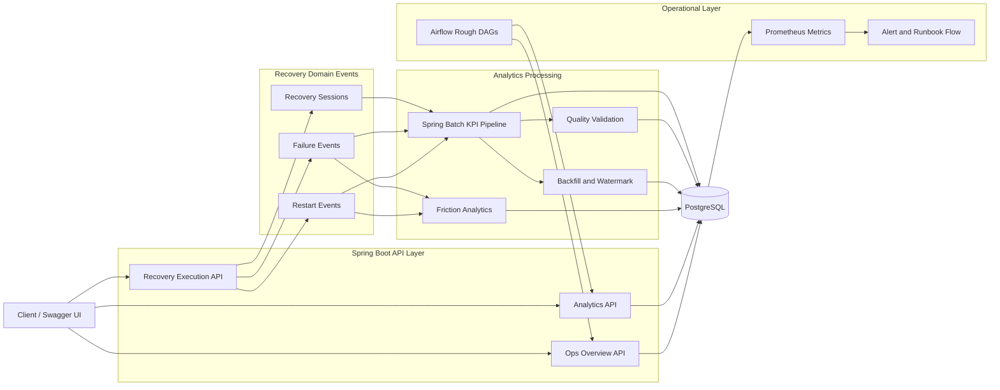

# RebootFocus

하루가 한 번 무너지면 다음날까지 끌려가는 직장인을 위해, 실패 직후 재시작과 24시간 내 복귀를 설계하는 recovery analytics backend입니다.

RebootFocus는 단순한 할 일 앱이 아니라, `실패 기록 -> 재시작 -> 일간 KPI -> 운영 관측` 흐름을 하나의 제품 백엔드로 연결하는 포트폴리오 프로젝트입니다.

## 프로젝트 개요

- 복귀 세션 시작, 완료, 중단 흐름을 관리합니다.
- 실패 체크인과 재시작 이벤트를 기록합니다.
- Spring Batch 기반으로 일간 KPI mart와 quality report를 생성합니다.
- PostgreSQL 기반 upsert와 watermark 추적으로 재실행 안전성을 확보합니다.
- 운영 개요, 알림, 룬북 흐름을 통해 관측 가능한 시스템을 목표로 합니다.

## 시스템 아키텍처



```text
Client / Swagger
    -> Recovery Execution API
    -> Analytics API
    -> Ops Overview API

Recovery Domain Events
    -> Spring Batch KPI Pipeline
    -> Quality Validation
    -> Watermark / Backfill
    -> Friction Analytics

Operational Layer
    -> Prometheus Metrics
    -> Alert / Runbook Flow
    -> Airflow Rough Orchestration Assets

Persistence
    -> PostgreSQL
```

## 기술 스택

- Backend: Java 21, Spring Boot 3, Spring Web, Spring Data JPA, Spring Batch
- Database: PostgreSQL, H2(test profile)
- Observability: Micrometer, Prometheus endpoint, custom ops overview endpoints
- Workflow: GitHub Actions CI/CD, Docker image build, Airflow rough DAG assets
- Docs/API: springdoc OpenAPI, Swagger UI

## 핵심 기능

- 복귀 실행 흐름
  - 복귀 세션 시작, 완료, 중단
  - 실패 체크인 및 재시작 처리
- 분석 파이프라인
  - 일간 KPI 생성
  - 품질 리포트 생성
  - 백필 재처리
  - 워터마크 추적
- 신뢰성
  - PostgreSQL 런타임 검증
  - KPI mart native upsert
  - 워터마크 비회귀 갱신
- 운영
  - 복귀 루프 운영 개요
  - 배치 운영 개요
  - 알림 및 룬북 흐름
  - Prometheus 메트릭 노출

## PostgreSQL 활용 포인트

이 프로젝트에서는 DB를 단순 저장소가 아니라 운영 상태의 기준선으로 사용합니다.

- `daily_kpi_metrics`는 `ON CONFLICT` 기반 upsert로 중복 적재 없이 갱신됩니다.
- `daily_kpi_watermarks`는 더 이른 날짜를 재처리해도 마지막 처리 지점이 뒤로 가지 않도록 설계했습니다.
- H2 호환 모드가 아니라 실제 PostgreSQL 런타임 기준으로 로컬 실행과 CI 검증을 분리했습니다.

즉, RebootFocus의 PostgreSQL 활용 포인트는 `정합성`, `재실행 안전성`, `운영 추적 가능성`입니다.

## 실행 방법

### 1. PostgreSQL 실행

```bash
docker compose up -d postgres
```

기본 접속 정보
- `DB_HOST=localhost`
- `DB_PORT=5432`
- `DB_NAME=rebootfocus`
- `DB_USERNAME=rebootfocus`
- `DB_PASSWORD=rebootfocus`

### 2. 애플리케이션 실행

```bash
JAVA_HOME=$(/usr/libexec/java_home -v 21) ./gradlew bootRun
```

### 3. 확인 경로

- Health: `http://localhost:8080/api/v1/health`
- Swagger UI: `http://localhost:8080/swagger-ui/index.html`
- OpenAPI: `http://localhost:8080/api-docs`
- Actuator Health: `http://localhost:8080/actuator/health`
- Prometheus: `http://localhost:8080/actuator/prometheus`

## 테스트와 배포

### 테스트

```bash
JAVA_HOME=$(/usr/libexec/java_home -v 21) ./gradlew test
```

- 일반 테스트는 `test` 프로필의 H2 메모리 DB를 사용합니다.
- CI에서는 PostgreSQL service container 기반 KPI integration test를 추가로 실행합니다.

### CI/CD 자동화

- CI
  - `main`, `feature/**` push와 `main` 대상 PR에서 테스트를 자동 실행합니다.
  - PostgreSQL 기반 통합 검증을 별도 job으로 분리했습니다.
- CD
  - `main` push 시 `bootJar`와 Docker image artifact를 생성합니다.
  - `v*` 태그 push 시 jar와 image tar를 릴리즈 자산으로 업로드합니다.

## 기대 효과

- 실패 후 복귀를 감정이 아니라 데이터로 추적할 수 있습니다.
- 이벤트 기반 실행 기록을 KPI mart로 승격해 운영 지표를 축적할 수 있습니다.
- backfill, watermark, alert 흐름을 통해 배치 운영 대응 경험을 보여줄 수 있습니다.
- PostgreSQL, Spring Batch, CI/CD, 관측 지표를 하나의 백엔드 스토리로 묶을 수 있습니다.

## 포트폴리오 포인트

이 프로젝트는 아래 역량을 하나의 흐름으로 보여주기 위한 포트폴리오입니다.

- Spring Boot 기반 도메인 API 설계
- PostgreSQL 기반 상태 일관성 설계
- Spring Batch 기반 데이터 파이프라인 구성
- 운영 관측, 알림, 룬북 설계
- GitHub Actions 기반 CI/CD 자동화
