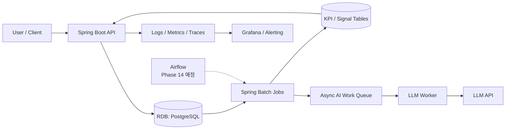

# RebootFocus Architecture Overview

> Version: v0.1  
> Updated: 2026-03-16  
> Scope: 시스템 경계, 핵심 런타임 경로, 데이터/배치/운영 구성을 한 문서에서 보는 아키텍처 개요

## 1. 목적

- 이 문서는 "전체 구조를 한 장으로 설명하는 문서"다.
- 요구사항/NFR의 원문은 `docs/spec/ENGINEERING_SPEC.md`를 기준으로 한다.
- 기능 상세/예외 시퀀스는 `docs/spec/KEY_FLOWS.md`, 데이터 상세는 `docs/spec/DATA_MODEL.md`를 기준으로 한다.

## 2. 시스템 한 줄 설명

RebootFocus는 "전날 계획이 무너지면 다음날까지 다시 못 붙잡는 직장인"을 위해, 놓친 일을 실패 맥락에 맞는 다음 행동과 첫 복귀 블록으로 다시 시작하게 만드는 복귀 코치 백엔드 시스템이다.

## 3. 아키텍처 원칙

- 기본 구조는 `Spring Boot` 기반 Modular Monolith로 유지한다.
- 핵심 복귀 경로는 동기 API + RDB 트랜잭션으로 단순하게 시작한다.
- 분석/회고/품질 검증은 배치 경로로 분리한다.
- 기술 확장은 수치 기반 트리거가 있을 때만 승격한다.
- 타이머/세션은 제품 정체성이 아니라 복귀 행동을 실행시키는 인터랙션으로 본다.

## 4. 시스템 컨텍스트

## 5. 런타임 경로

### 5.1 동기 경로 (핵심 복귀 루프)

- Brain Dump 등록
- Big3 선택
- 첫 복귀 블록 포함 Timebox 배정
- 복귀 세션 시작/완료/중단
- 실패 체크인
- 10분 복귀 재시작

특징:
- 사용자 체감 지연이 큰 경로이므로 API + DB 트랜잭션으로 즉시 처리한다.
- 핵심 상태는 Strong Consistency를 우선한다.
- KPI 계산은 이 경로에서 직접 하지 않고 이벤트를 남긴 뒤 배치에서 집계한다.

### 5.2 비동기/배치 경로

- `daily_kpi_pipeline`: 복귀 KPI 집계
- `weekly_retrospective_input`: 주간 회고 입력 생성
- `backfill_reprocess`: 기간 단위 재처리
- `recovery_friction_signals`: 반복 실패/다음날 미복귀/과부하 신호 계산
- `AI retrospective worker`: 주간 회고 코칭 생성

특징:
- 재시도, 재처리, 품질 검증이 가능해야 한다.
- 사용자 요청 경로와 분리해 장애 반경을 줄인다.

## 6. 논리 구성

### 6.1 애플리케이션 계층

- `interface`: Controller, 요청/응답 계약
- `application`: Use case, orchestration, port
- `domain`: 복귀 규칙, 상태 전이, 검증
- `infrastructure`: DB, 배치, 외부 연동, 관측성

### 6.2 주요 도메인 객체

- `InboxItem`
- `DailyBig3`
- `Timebox`
- `RecoverySession`
- `FailureEvent`
- `RestartEvent`
- `CycleEvent`
- `RecoveryFrictionSignal`

## 7. 데이터 흐름

### 7.1 OLTP

- API 요청 -> 트랜잭션 저장 -> 로그/메트릭 기록

대표 테이블:
- `inbox_items`
- `daily_big3`
- `timeboxes`
- `recovery_sessions`
- `failure_events`
- `restart_events`
- `cycle_events`

### 7.2 Analytics / Reporting

- OLTP 이벤트 -> 정제/집계 -> KPI mart / signal table -> 대시보드/회고/실험 해석

대표 산출물:
- `Recovery24`, `Recovery48`
- `RestartCount24/48`
- `TTR`
- `CycleCompletionRate`
- `recovery_friction_signals`

## 8. 배포/운영 관점 구성

- API 서비스: Spring Boot 단일 애플리케이션
- 주 저장소: Spring Data JPA + PostgreSQL
- 배치 실행기: Spring Batch
- 오케스트레이션: 현재는 애플리케이션 내부 실행, Airflow는 Phase 14 예정
- 운영 가시성: Actuator + Metrics + Grafana/Alerting
- 비동기 AI 경로: Worker + Queue + LLM API

운영 원칙:
- 배치 실패는 워터마크 유지 후 재처리 가능해야 한다.
- 핵심 KPI와 DQ 지표는 대시보드에서 확인 가능해야 한다.
- 복귀 코어 경로의 장애는 AI/배치 장애와 분리되어야 한다.

## 9. 현재 확정 기술 스택과 도입 경계

### 9.1 현재 확정 스택

- Language: `Java 21`
- Framework: `Spring Boot 3.3.8`
- Build: `Gradle 8.13 (Wrapper)`
- API: `REST (/api/v1)`
- Validation: `spring-boot-starter-validation`
- Observability Base: `Spring Actuator`
- Test: `JUnit 5`, `Spring Boot Test`, `MockMvc`
- CI/CD: `GitHub Actions`

### 9.2 데이터/메시징/분석 기본 경로

- 기본 트랜잭션 저장소: `PostgreSQL`
- 캐시/저지연 조회: `Redis` (필요 시 도입)
- 메시징:
  - Stage 0: 내부 비동기 + 배치 재동기화
  - Stage 1: Transactional Outbox + Relay Worker
  - Stage 2: Outbox + Message Broker
- 분석:
  - 기본 경로: `Spring Batch + RDB Native SQL`
  - 확장 경로: `Spark + Data Lake + Redis`

### 9.3 의도적으로 늦춘 기술

- `Kafka`
- `Transactional Outbox`
- `Spark`
- `MCP`

원칙:
- 현재 기본 스택에 `Spark`는 포함하지 않는다.
- 확장 기술은 운영 복잡도보다 명확한 이점이 생길 때만 기본 경로로 승격한다.

## 10. 확장 포인트

### 10.1 Event Relay

- 기본: DB 기반 단순 경로
- 확장: Outbox + Relay
- 조건: 비동기 실패율, 재처리 횟수, 외부 소비자 증가

### 10.2 Analytics Engine

- 기본: Batch SQL + RDB
- 확장: Spark/Data Lake
- 조건: 처리량, 데이터량, 재처리 비용이 임계치를 넘는 경우

## 11. 현재 아키텍처의 의도적 한계

- 대규모 분산 아키텍처를 전제로 하지 않는다.
- Kafka/Spark를 기본값으로 두지 않는다.
- 소셜/B2B/인접 세그먼트 확장을 코어 경로보다 우선하지 않는다.

## 12. 관련 문서

- 요구사항/기준선: `docs/spec/ENGINEERING_SPEC.md`
- 기능/프로세스: `docs/spec/FEATURE_PROCESS_SPEC.md`
- 핵심 시퀀스: `docs/spec/KEY_FLOWS.md`
- 데이터 모델: `docs/spec/DATA_MODEL.md`
- 데이터 파이프라인: `docs/spec/DATA_PIPELINE_ETL_BLUEPRINT.md`
- 배치 운영: `docs/spec/BATCH_RUNBOOK.md`
- KPI 정의: `docs/spec/RECOVERY_METRICS.md`
