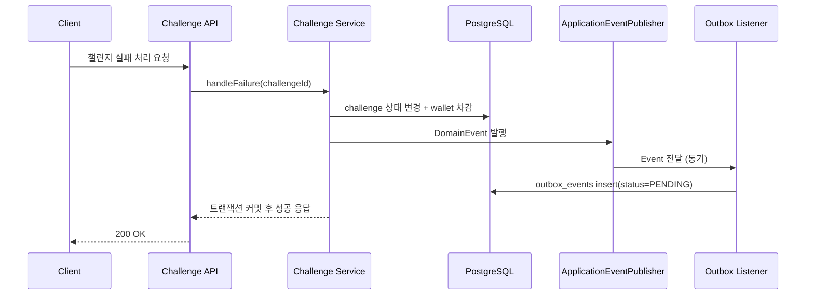
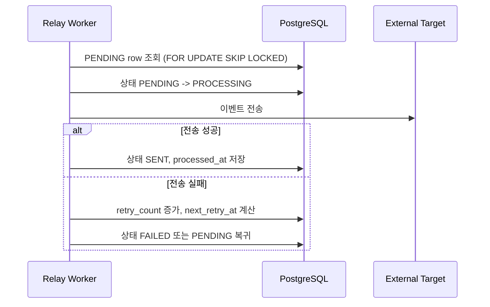
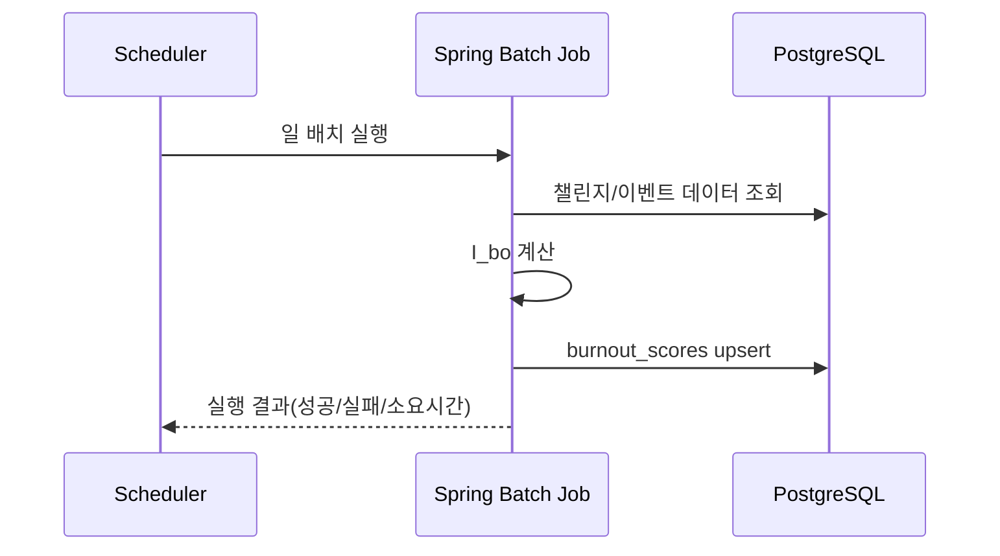
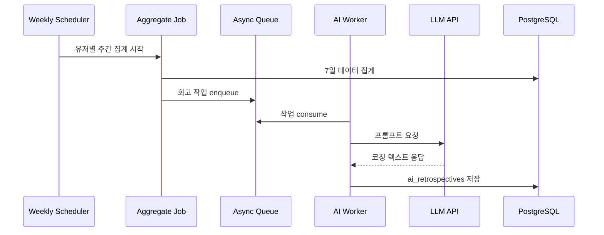

# Key Logic Flows

> Version: v0.1  
> Updated: 2026-03-03  
> Scope: 핵심 비즈니스/이벤트/배치/AI 흐름

## 1. 챌린지 실패 처리 + Outbox 기록

트랜잭션 경계:

- `challenge update + wallet transaction + outbox insert`는 하나의 트랜잭션으로 묶는다.
- Outbox 저장 실패 시 전체 트랜잭션은 롤백되어야 한다.

## 2. Relay 워커 처리 (멱등)

멱등 기준:

- `event_id`를 키로 중복 전송/중복 반영을 방지한다.
- 동일 이벤트 재시도 시 시스템 상태가 추가로 변하지 않아야 한다.

## 3. 배치 번아웃 계산 (Track A)

## 4. AI 주간 회고 (비동기)

예외 시나리오:

- LLM timeout: 재시도 정책 적용 후 fallback 메시지 저장
- 작업 중복 소비: 유저/주차 유니크 키로 중복 저장 방지
