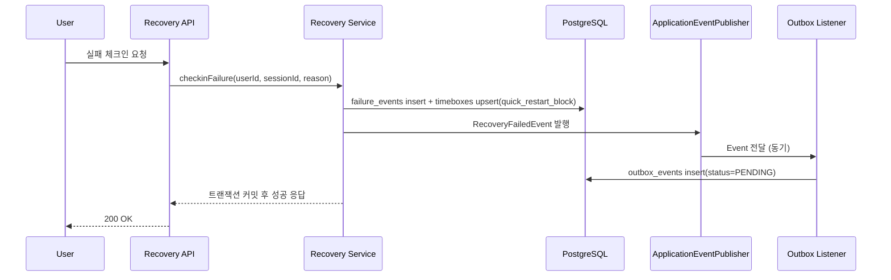
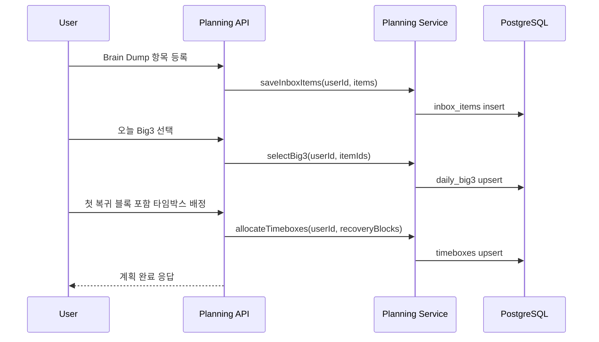
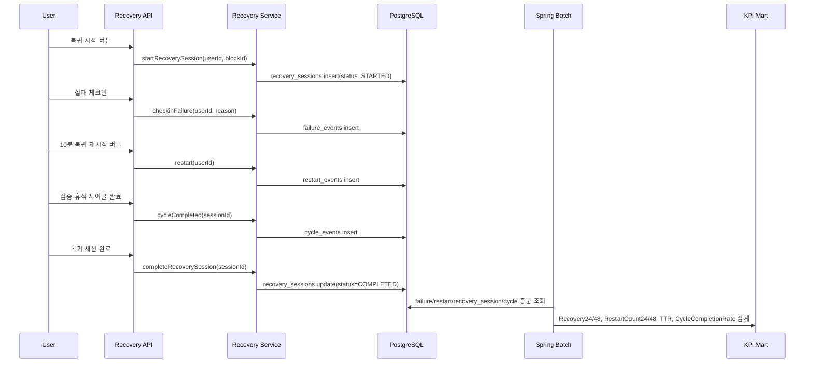
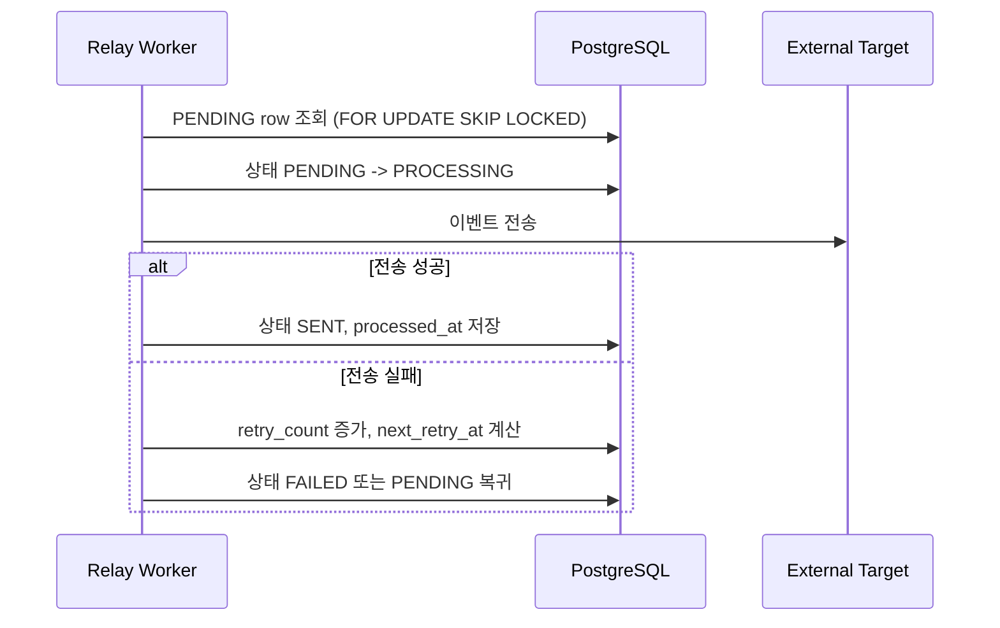
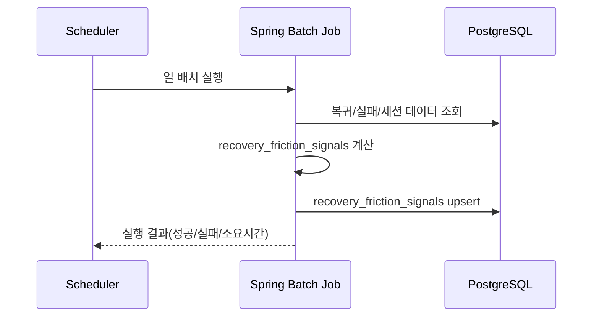
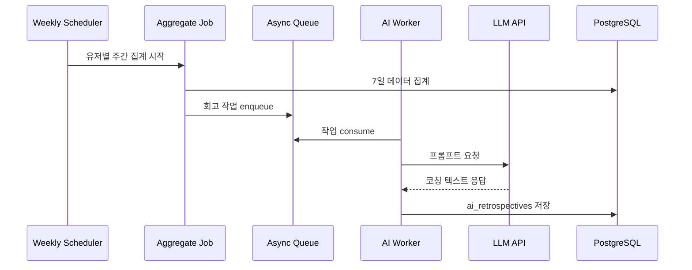

# Key Logic Flows

> Version: v0.4  
> Updated: 2026-03-16  
> Scope: 핵심 비즈니스/이벤트/배치/AI 흐름 + 복귀 지표 수집

## 0. 읽는 법

- 이 문서는 다이어그램만 보는 문서가 아니라, 각 다이어그램이 실제로 어떻게 작동하는지 글로 풀어쓴 설명도 함께 담는다.
- 각 파트는 아래 관점으로 읽는다.
  - 이 흐름은 어떤 문제를 해결하려는가
  - 누가 시작하는가
  - 시스템이 어떤 순서로 처리하는가
  - 어떤 데이터가 어디에 저장되는가
  - 예외가 나면 무엇이 롤백되거나 보류되는가
  - 왜 이 흐름이 제품/데이터/운영 관점에서 중요한가
- `Stage 1 reference`가 붙은 다이어그램은 현재 구현 상태만이 아니라 목표 아키텍처 흐름까지 포함한다.

## 1. 실패 체크인 + Outbox 기록 (Stage 1 reference)

### 1.1 이 흐름은 무엇인가

이 흐름은 사용자가 복귀 세션 도중 실패했다고 기록하는 순간을 시스템 관점에서 어떻게 처리하는지 설명한다.  
핵심은 실패를 단순 메모처럼 남기는 것이 아니라, 이후 재시작 제안과 외부 후속 처리까지 연결 가능한 구조화 이벤트로 확정하는 것이다.

이 흐름에서 시스템은 세 가지를 동시에 하려고 한다.

- 실패 사실을 `failure_events`에 남긴다.
- 사용자가 바로 다시 붙잡을 수 있도록 빠른 재시작용 timebox를 준비한다.
- 이후 외부 소비자나 비동기 후속 처리가 가능하도록 outbox에도 이벤트를 남긴다.

즉 "실패를 기록했다"가 아니라 "실패 -> 빠른 재시작 준비 -> 후속 처리 예약"까지 묶는 흐름이다.

### 1.2 누가 시작하는가

이 흐름은 사용자가 실패 체크인 버튼을 누르거나 실패 사유를 선택하는 순간 시작된다.

사용자가 보내는 최소 정보는 아래와 같다.

- `userId`
- `sessionId`
- `reason`

상황에 따라 note나 실패 시점 메타데이터가 더 붙을 수 있지만, 핵심 입력은 위 세 개다.

### 1.3 시스템이 어떻게 처리하는가

1. 사용자가 실패 체크인 요청을 보낸다.
2. API 레이어는 요청 형식이 맞는지 먼저 검증한다.
3. 서비스는 해당 세션이 실제 존재하는지, 현재 실패 체크인이 가능한 상태인지 확인한다.
4. 검증이 통과하면 `failure_events`에 실패 이벤트를 저장한다.
5. 동시에 사용자가 바로 다시 시작할 수 있도록 `quick_restart_block` 성격의 timebox를 upsert한다.
6. 그다음 서비스는 `RecoveryFailedEvent` 같은 내부 이벤트를 발행한다.
7. 이벤트 리스너는 이 이벤트를 받아 `outbox_events`에 `PENDING` 상태로 저장한다.
8. 이 모든 작업이 성공해야 트랜잭션이 커밋된다.
9. 커밋이 완료된 뒤에만 API는 사용자에게 성공 응답을 반환한다.

### 1.4 무엇이 저장되는가

이 흐름에서 저장되는 핵심 데이터는 세 가지다.

- `failure_events`
  - 어떤 사용자가
  - 어떤 세션에서
  - 어떤 이유로 실패했는지
- `timeboxes`
  - 실패 직후 다시 시작할 수 있도록 준비된 빠른 재시작 블록
- `outbox_events`
  - 나중에 외부 시스템이나 비동기 워커가 읽어갈 후속 처리 이벤트

이 세 데이터는 의미적으로 한 묶음이다.

트랜잭션 경계:

- `failure_events insert + timeboxes upsert(quick_restart_block) + outbox insert`는 하나의 트랜잭션으로 묶는다.
- Outbox 저장 실패 시 전체 트랜잭션은 롤백되어야 한다.

### 1.5 예외와 롤백을 왜 강하게 잡는가

이 흐름은 부분 성공을 허용하지 않는다.

- 실패 이벤트만 저장되고 outbox가 없으면 이후 후속 처리와 추적이 끊긴다.
- timebox만 생기고 failure event가 없으면 사용자의 행동 이유를 해석할 수 없다.
- outbox가 빠지면 시스템은 실패를 기록했지만 이후 비동기 후속 처리를 보장하지 못한다.

그래서 outbox insert가 실패하면 전체 트랜잭션이 롤백되어야 한다.

### 1.6 왜 중요한가

이 흐름은 실패를 "끝"이 아니라 "복귀 루프의 중간 상태"로 다룬다는 점에서 중요하다.

- 제품 관점에서는 실패 직후 다시 붙잡을 계기를 만들 수 있다.
- 데이터 관점에서는 실패 원인과 재시작 여부를 연결해 볼 수 있다.
- 시스템 관점에서는 이후 외부 연동이 들어와도 유실 없이 확장할 수 있다.

## 1A. 일일 복귀 계획 루프 (Brain Dump -> Big3 -> Timeboxing)

### 1A.1 이 흐름은 무엇인가

이 흐름은 사용자가 "오늘 무엇을 다시 붙잡을지"를 실제 실행 가능한 계획으로 만드는 과정이다.  
일반적인 생산성 앱의 전체 일정 관리 흐름이 아니라, 실패 다음날 다시 시작하기 위한 최소한의 복귀 계획 루프다.

핵심 순서는 아래와 같다.

- Brain Dump: 머릿속에 있는 일을 밖으로 꺼낸다.
- Big3: 오늘 다시 붙잡을 핵심 1~3개를 고른다.
- Timeboxing: 그 일을 실제 시간 블록으로 배정한다.

여기서 가장 중요한 점은 `첫 복귀 블록`이 반드시 명시되어야 한다는 것이다.

### 1A.2 Brain Dump 단계

1. 사용자는 해야 할 일, 밀린 일, 불안한 일들을 Brain Dump로 입력한다.
2. API는 `saveInboxItems(userId, items)`를 서비스로 전달한다.
3. 서비스는 이를 `inbox_items`에 저장한다.
4. 이 단계에서는 우선순위를 아직 강하게 정하지 않는다.

이 단계의 목적은 사용자가 복귀하기 전에 머릿속 부담을 먼저 비우는 것이다.

### 1A.3 Big3 단계

1. 사용자는 Brain Dump 항목 중 오늘 다시 붙잡을 핵심 항목 1~3개를 고른다.
2. API는 `selectBig3(userId, itemIds)`를 호출한다.
3. 서비스는 아래를 검증한다.
   - itemId가 중복되지 않았는지
   - 실제 존재하는 inbox item인지
   - 3개를 초과하지 않는지
4. 검증이 통과하면 `daily_big3`에 저장한다.

이 단계의 목적은 모든 일을 다 하려 하지 않고, 복귀에 필요한 최소 핵심만 좁히는 것이다.

### 1A.4 Timeboxing 단계

1. 사용자는 Big3를 실제 시간 블록에 배정한다.
2. API는 `allocateTimeboxes(userId, recoveryBlocks)`를 호출한다.
3. 서비스는 아래를 검증한다.
   - 배정 대상이 오늘 Big3에 포함된 항목인지
   - 시작/종료 시간이 유효한지
   - 블록끼리 겹치지 않는지
   - 첫 복귀 블록이 정확히 지정됐는지
4. 검증이 통과하면 `timeboxes`에 저장한다.
5. 이후 계획 완료 응답을 반환한다.

이 단계의 목적은 "해야 할 일"을 "몇 시에 무엇으로 다시 시작할지"로 바꾸는 것이다.

예외 시나리오:

- Big3가 3개 초과 선택되면 검증 에러 반환
- 타임박스 겹침 시 충돌 에러 반환
- 실패 체크인 시 10분 재타임박스 자동 제안

### 1A.5 왜 이 예외들을 강하게 막는가

이 흐름의 예외는 단순 입력 에러가 아니다. 복귀 계획 자체를 망가뜨리는 구조적 문제다.

- Big3를 너무 많이 선택하면 다시 "모든 걸 다 해야 한다"는 상태로 돌아간다.
- timebox가 겹치면 실행 가능한 계획이 아니다.
- 첫 복귀 블록이 없으면 사용자는 다시 시작할 첫 행동을 잃는다.

그래서 이 단계는 유연성보다 실행 가능성을 우선한다.

### 1A.6 왜 중요한가

이 흐름은 RebootFocus의 시작점이다.

- Brain Dump는 부담을 꺼내는 단계
- Big3는 초점을 좁히는 단계
- Timeboxing은 실제 행동으로 연결하는 단계

즉, 이 루프는 계획 기능이 아니라 복귀를 시작하게 만드는 행동 설계다.

## 1B. 실패 후 재시작 지표 수집 (Recovery Metric Pack)

### 1B.1 이 흐름은 무엇인가

이 흐름은 사용자의 복귀 행동이 어떻게 원천 이벤트로 저장되고, 그 이벤트가 나중에 KPI로 계산되는지를 설명한다.

중요한 점은 KPI를 API 요청 시점에 직접 계산하지 않는다는 것이다.  
API는 원천 이벤트를 남기고, 배치가 나중에 이를 증분 조회해 집계한다.

즉 구조는 아래 순서다.

- 사용자 행동 발생
- 원천 이벤트 저장
- 배치가 이벤트 조회
- KPI mart 적재

### 1B.2 복귀 세션 시작

1. 사용자가 복귀 시작 버튼을 누른다.
2. API는 `startRecoverySession(userId, blockId)`를 호출한다.
3. 서비스는 해당 block 또는 timebox가 실제 존재하는지 확인한다.
4. 유효하면 `recovery_sessions`에 `STARTED` 상태 세션을 저장한다.

이 단계는 "다시 시작하려고 시도했다"는 사실을 남기는 출발점이다.

### 1B.3 실패 체크인

1. 사용자가 세션 도중 실패를 기록한다.
2. API는 `checkinFailure(userId, reason)`를 호출한다.
3. 서비스는 실패 원인을 구조화해서 `failure_events`에 저장한다.

이 단계는 단순 중단이 아니라 "왜 멈췄는가"를 데이터로 남긴다는 점이 중요하다.

### 1B.4 재시작

1. 사용자가 실패 직후 다시 10분 복귀 재시작 버튼을 누른다.
2. API는 `restart(userId)`를 호출한다.
3. 서비스는 `restart_events`를 저장한다.

이 단계가 있어야 `Recovery24`, `Recovery48`, `RestartCount` 같은 지표가 계산 가능해진다.

### 1B.5 집중-휴식 사이클

1. 사용자가 집중 세션 중 사이클을 시작하고 완료한다.
2. 시스템은 `cycle_events`를 저장한다.
3. 이후 `CycleCompletionRate`, `EffectiveFocusMinutes` 같은 실행 품질 지표를 계산할 수 있다.

이 단계는 "다시 시작했는가"뿐 아니라 "시작한 뒤 실제로 얼마나 실행했는가"를 보기 위한 보조 데이터다.

### 1B.6 세션 완료

1. 사용자가 복귀 세션을 끝낸다.
2. API는 `completeRecoverySession(sessionId)`를 호출한다.
3. 서비스는 `recovery_sessions` 상태를 `COMPLETED`로 업데이트한다.

이 단계로 세션은 종료되고, 시작/중단/완료 라이프사이클이 닫힌다.

### 1B.7 배치 집계

1. 현재는 Spring Batch가 주기적으로 실행된다.
2. Airflow는 `Phase 14`에서 배치 오케스트레이션 계층으로 별도 도입될 예정이다.
3. DB에서 `failure_events`, `restart_events`, `recovery_sessions`, `cycle_events`를 증분 조회한다.
4. 이 원천 이벤트를 기준으로 KPI를 계산한다.
5. 계산 결과를 KPI mart에 적재한다.
6. 동시에 `failure_events`의 로컬 시각 정보를 기준으로 시간대별 실패 분포와 피크 실패 시간대를 계산할 수 있다.

여기서 계산되는 주요 지표는 아래와 같다.

- `Recovery24`
- `Recovery48`
- `RestartCount24`
- `RestartCount48`
- `TTR`
- `CycleCompletionRate`
- `FailureCountByHour`
- `PeakFailureHour`

집계 규칙:
- `Recovery24`: 실패 후 24시간 내 재시작 여부
- `Recovery48`: 실패 후 48시간 내 재시작 여부
- 3분 미만 재시작은 스팸성으로 별도 분리
- 횟수 지표는 `CycleCompletionRate`, `EffectiveFocusMinutes`와 함께 해석

### 1B.8 왜 중요한가

이 흐름은 제품 메시지와 데이터 구조가 직접 연결되는 경로다.

- 제품은 "실패 다음날 복귀"를 해결한다고 말한다.
- 그러려면 실패, 재시작, 실행 품질이 모두 원천 이벤트로 남아야 한다.
- 그래야 `Recovery24` 같은 KPI가 허상이 아니라 실제 행동 기반 지표가 된다.

## 2. Relay 워커 처리 (멱등)

### 2.1 이 흐름은 무엇인가

이 흐름은 outbox에 저장된 이벤트를 외부 시스템으로 안전하게 내보내는 비동기 전달 흐름이다.

핵심 목표는 두 가지다.

- 이벤트를 잃지 않는 것
- 같은 이벤트가 재시도되더라도 시스템 상태가 깨지지 않게 하는 것

### 2.2 시스템이 어떻게 처리하는가

1. Relay 워커가 `PENDING` 상태 이벤트를 조회한다.
2. 조회 시 `FOR UPDATE SKIP LOCKED`를 사용해 다른 워커와 같은 row를 동시에 잡지 않게 한다.
3. 선택된 이벤트 상태를 `PROCESSING`으로 바꾼다.
4. 외부 타깃 시스템으로 이벤트를 전송한다.
5. 전송 성공 시 상태를 `SENT`로 바꾸고 `processed_at`을 저장한다.
6. 전송 실패 시 `retry_count`를 증가시키고 다음 재시도 시각을 계산한다.
7. 정책에 따라 `FAILED`로 남기거나 다시 `PENDING`으로 되돌린다.

### 2.3 멱등성이 왜 필요한가

멱등 기준:

- `event_id`를 키로 중복 전송/중복 반영을 방지한다.
- 동일 이벤트 재시도 시 시스템 상태가 추가로 변하지 않아야 한다.

비동기 전달에서는 네트워크 실패, 타임아웃, 워커 재시작 때문에 같은 이벤트가 여러 번 처리될 수 있다.  
그래서 동일 이벤트 재시도 시 외부 시스템 상태가 두 번 바뀌면 안 된다.

### 2.4 왜 중요한가

이 흐름이 중요한 이유는 사용자 API 경로와 외부 전달 경로를 분리하기 위해서다.

- 사용자는 빠르게 응답받고
- 외부 연동은 나중에 재시도 가능하게 처리한다.

즉, 응답 속도와 전달 신뢰성을 동시에 확보하기 위한 구조다.

## 3. 배치 복귀 마찰/과부하 신호 계산 (Track A)

### 3.1 이 흐름은 무엇인가

이 흐름은 "이 사용자가 왜 반복적으로 복귀에 실패하는가"를 행동 데이터 기반으로 추정하는 분석 배치다.  
즉, 실시간 API가 아니라 하루 단위 분석 잡이다.

### 3.2 시스템이 어떻게 처리하는가

1. 스케줄러가 일 배치를 시작한다.
2. Spring Batch 잡이 복귀, 실패, 세션 데이터를 조회한다.
3. 잡 내부 계산 로직이 반복 실패, 다음날 미복귀, 과도한 중단 같은 패턴을 바탕으로 `recovery_friction_signals`를 계산한다.
4. 계산 결과를 `recovery_friction_signals`에 upsert한다.
5. 실행 성공/실패/소요시간을 스케줄러에 돌려준다.

### 3.3 이 배치가 실제로 하는 일

이 배치는 단순 건수 집계가 아니라 "마찰 신호"를 만드는 역할을 한다.

예를 들면 아래와 같은 질문에 답하기 위한 구조다.

- 어떤 사용자가 반복적으로 실패하는가
- 실패 후 다음날까지 다시 시작하지 못하는 패턴이 있는가
- 특정 failure reason이 반복되는가
- 계획은 세우는데 세션이 자주 끊기는가
- 특정 시간대에 실패가 집중되는가

### 3.4 왜 중요한가

이 흐름은 제품 개선과 운영 개선을 모두 뒷받침한다.

- 제품 측면에서는 어떤 복귀 액션이 더 필요한지 판단할 수 있다.
- 데이터 측면에서는 세그먼트 리포트와 실험 가설을 만들 수 있다.
- 운영 측면에서는 사용자 문제와 시스템 문제를 분리해서 볼 수 있다.

## 4. AI 주간 회고 (비동기)

### 4.1 이 흐름은 무엇인가

이 흐름은 주간 실행 데이터를 바탕으로 AI 회고/코칭 텍스트를 생성하는 비동기 흐름이다.

중요한 점은 AI 호출을 사용자 동기 API 경로에 두지 않는다는 것이다.  
즉, 복귀 코어 경로를 보호하기 위해 주간 회고는 완전히 비동기로 분리한다.

### 4.2 시스템이 어떻게 처리하는가

1. 주간 스케줄러가 유저별 집계를 시작한다.
2. 집계 잡이 최근 7일 데이터를 모은다.
3. 집계 결과를 바로 LLM에 보내지 않고 큐에 작업으로 적재한다.
4. AI 워커가 큐에서 작업을 소비한다.
5. 워커가 LLM API에 프롬프트를 보낸다.
6. LLM이 코칭 텍스트를 반환한다.
7. 워커는 결과를 `ai_retrospectives`에 저장한다.

### 4.3 왜 큐를 두는가

큐를 두는 이유는 아래와 같다.

- 대량 사용자 처리 시 요청을 완충할 수 있다.
- 워커를 독립적으로 재시도하거나 확장할 수 있다.
- AI 호출 실패가 사용자 API 실패로 바로 이어지지 않는다.

예외 시나리오:

- LLM timeout: 재시도 정책 적용 후 fallback 메시지 저장
- 작업 중복 소비: 유저/주차 유니크 키로 중복 저장 방지

### 4.4 예외를 어떻게 다루는가

- LLM timeout이 나면 바로 실패로 끝내지 않고 재시도한다.
- 재시도 후에도 실패하면 fallback 메시지를 저장해 사용자 경험을 완전히 비우지 않는다.
- 같은 유저/같은 주차 작업이 중복 소비되더라도 유니크 키로 중복 저장을 막는다.

즉, AI는 있어도 좋지만 없어도 코어 제품이 망가지지 않는 구조여야 한다.

### 4.5 왜 중요한가

이 흐름이 중요한 이유는 AI 기능을 넣더라도 핵심 복귀 경로를 오염시키지 않기 위해서다.

- 복귀 시작/실패/재시작은 동기 경로
- 주간 회고는 비동기 경로

이 분리가 있어야 장애 반경을 줄이고 비용과 성능 문제도 통제할 수 있다.
